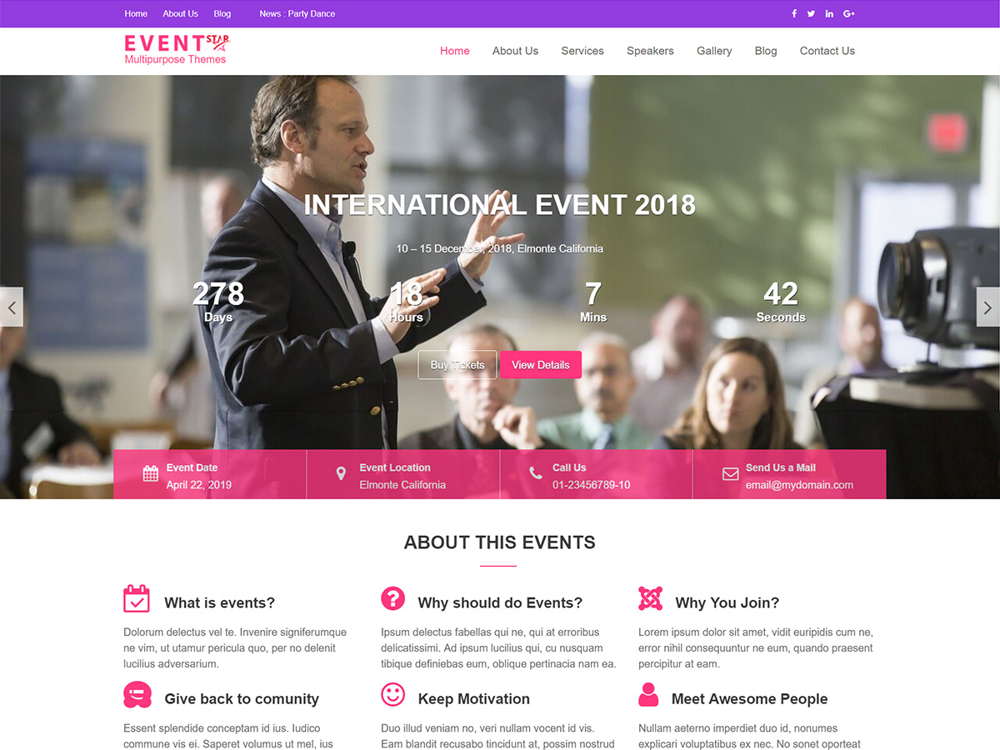

# Event Star

**Contributors:** acmethemes  
**Requires at least:** 6.6  
**Tested up to:** 7.0  
**Requires PHP:** 7.4  
**Stable tag:** 4.0.0  
**License:** GPLv2 or later  
**License URI:** https://www.gnu.org/licenses/gpl-2.0.html  

> 

Event Star is a bright, modern WordPress theme purpose-built for conferences, seminars, weddings, and any event management website. It comes with a countdown timer, event schedule section, speaker profiles, and all the tools you need to promote and manage your event online.

## Features

- **Countdown timer** — build anticipation with a featured countdown
- **Event schedule** — display timetables and session details
- **Speakers/Team section** — showcase your lineup
- **FAQ/Accordion** — answer attendee questions without clutter
- **Gallery section** — photo galleries of past events
- **Testimonials** — social proof from past attendees
- **Upcoming events widget** — keep visitors informed
- **About/Service section** — tell your event story
- **Contact section** — make it easy to reach you
- **Post formats** — standard, gallery, image, and video
- **Up to four-column layouts** — flexible grid for any content
- **Custom colors & background** — match your event branding
- **Footer widgets** — sponsors, links, and social media
- **Translation ready** — .pot file included
- **RTL support** — right-to-left language compatible
- **WooCommerce compatible** — sell tickets online

## Installation

1. Download the theme zip file.
2. In your WordPress admin, go to **Appearance → Themes**.
3. Click **Add New** → **Upload Theme**.
4. Select the zip file and click **Install Now**.
5. Click **Activate**.

## Frequently Asked Questions

### How do I set up the countdown timer?

Go to **Appearance → Customize → Featured Section Option** and enable the countdown display.

### How do I add the event schedule?

Use the dedicated **Event Schedule** widget or section from **Appearance → Customize**.

## Credits

Event Star is built on [Underscores](https://underscores.me/) and licensed under GPLv2 or later. It bundles the following third-party resources:

- [Google Fonts](https://fonts.google.com/) — Apache License 2.0
- [Font Awesome](https://fontawesome.com/) — MIT / SIL OFL 1.1
- [normalize.css](https://necolas.github.io/normalize.css/) — MIT
- [Bootstrap](http://getbootstrap.com/) — MIT
- [Isotope](https://isotope.metafizzy.co/) — GPLv3
- [Magnific Popup](https://github.com/dimsemenov/Magnific-Popup) — MIT
- [Theia Sticky Sidebar](https://github.com/WeCodePixels/theia-sticky-sidebar) — MIT
- [Breadcrumb Trail](https://github.com/justintadlock/breadcrumb-trail) — GPLv2+
- [TGM Plugin Activation](http://tgmpluginactivation.com/) — GPLv2+
- [html5shiv](https://github.com/afarkas/html5shiv) — MIT
- [Respond.js](https://github.com/scottjehl/Respond) — MIT
- [Waypoints](https://github.com/imakewebthings/waypoints/) — MIT
- [WOW](https://github.com/matthieua/WOW) — MIT
- [Slick](https://github.com/kenwheeler/slick/) — MIT
- [Easy Pie Chart](https://github.com/rendro/easy-pie-chart/) — MIT/GPL

---

[Demo](http://demo.acmethemes.com/event-star/) &middot; [Support](https://www.acmethemes.com/supports/) &middot; [Acme Themes](https://www.acmethemes.com)
